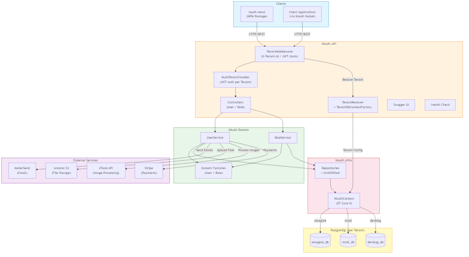

# NAuth.API - Multi-Tenant Authentication Framework


## Overview

**NAuth.API** is the central backend of the NAuth ecosystem — a complete, modular authentication framework designed for fast and secure user management in modern web applications. Built using **.NET 8** and **PostgreSQL**, it provides a robust REST API for user registration, login, password recovery, role management, and profile updates.

The project supports **multi-tenant architecture** with database-per-tenant isolation, where each tenant has its own PostgreSQL database, JWT secret, and S3 bucket. Tenant resolution happens via JWT claims or HTTP headers.

This is the **main project** of the NAuth ecosystem. The frontend component library [nauth-react](https://github.com/emaginebr/nauth-react) integrates with and consumes this API. The DTO and ACL packages are included in-solution under the `NAuth` project (also published as a NuGet package).

The project follows a clean architecture approach with separated layers for API, Application, Domain, Infrastructure, and comprehensive test coverage.

---

## 🚀 Features

- 🔐 **User Registration** - Complete registration flow with email confirmation
- 🔑 **JWT Authentication** - Secure token-based authentication with per-tenant secrets
- 🏢 **Multi-Tenant** - Database-per-tenant isolation with independent JWT secrets and S3 buckets
- 🔄 **Password Recovery** - Secure password reset via email with token validation
- ✏️ **Profile Management** - User profile update and password change
- 👥 **Role-Based Access Control** - User roles and permissions management
- 📧 **Email Integration** - Email templates via MailerSend
- 🗄️ **PostgreSQL Database** - Schema and migrations included
- 📦 **Modular Architecture** - Reusable across multiple projects via NuGet package
- 🌐 **REST API** - Complete RESTful API with Swagger documentation
- 🐳 **Docker Support** - Dev and production Docker Compose configurations
- ✅ **Health Checks** - Built-in health check endpoints
- 🔒 **Security** - Non-root containers, encrypted passwords, token validation
- 🖼️ **Image Processing** - Profile image upload and processing
- 💳 **Payment Integration** - Stripe payment processing support

---

## 🛠️ Technologies Used

### Core Framework
- **.NET 8.0** - Modern, cross-platform framework for building web APIs
- **ASP.NET Core** - Web framework for building HTTP services
- **Entity Framework Core 9.0** - ORM with lazy loading proxies

### Database
- **PostgreSQL 16** - Robust relational database
- **Npgsql.EntityFrameworkCore.PostgreSQL 9.0** - PostgreSQL provider for EF Core

### Security
- **JWT (JSON Web Tokens)** - Secure authentication with per-tenant signing keys
- **BCrypt.Net-Next 4.0** - Strong password hashing
- **Token-based Email Verification** - Secure email confirmation and password reset

### Additional Libraries
- **Swashbuckle.AspNetCore 9.0** - Swagger/OpenAPI documentation
- **AWSSDK.S3** - Amazon S3 file storage (per-tenant buckets)
- **Stripe.net** - Payment processing integration
- **SixLabors.ImageSharp** - Image processing
- **Newtonsoft.Json** - JSON serialization

### Testing
- **xUnit 2.4** - Unit testing framework
- **Moq 4.20** - Mocking framework
- **Coverlet** - Code coverage
- **EF Core InMemory** - In-memory database for tests

### DevOps
- **Docker** - Containerization with multi-stage builds
- **Docker Compose** - Dev and production orchestration
- **GitHub Actions** - CI/CD pipelines (version tagging, NuGet publish, production deploy)
- **GitVersion** - Semantic versioning (ContinuousDelivery mode)

---

## 📁 Project Structure

```
NAuth/
├── NAuth.API/                    # Web API layer
│   ├── Controllers/              # API endpoints (User, Role)
│   ├── Handlers/                 # MultiTenantHandler (JWT auth per tenant)
│   ├── Middlewares/               # TenantMiddleware (X-Tenant-Id header)
│   ├── Services/                  # TenantResolver, TenantDbContextFactory, TenantContext
│   ├── appsettings.*.json         # Configuration per environment
│   └── Startup.cs                 # Application configuration and DI
├── NAuth.Application/             # Application layer
│   └── Initializer.cs             # Dependency injection composition root
├── NAuth.Domain/                  # Domain layer with business logic
│   ├── Models/                    # Domain models
│   ├── Services/                  # UserService, RoleService
│   ├── Factory/                   # UserDomainFactory, RoleDomainFactory
│   └── Exceptions/                # Custom domain exceptions
├── NAuth.Infra/                   # Infrastructure layer
│   ├── Context/                   # NAuthContext (EF Core)
│   ├── Repository/                # Data access repositories
│   └── Migrations/                # EF Core migrations
├── NAuth.Infra.Interfaces/        # Repository and model interfaces
│   └── ITenantContext.cs           # Tenant context interface
├── NAuth/                         # NuGet package (DTOs + ACL)
│   ├── DTO/                       # Data transfer objects
│   └── ACL/                       # NAuthHandler, UserClient, RoleClient
├── NAuth.Test/                    # Test suite
│   ├── Domain/                    # Domain model and service tests
│   ├── Infra/                     # Repository tests (EF InMemory)
│   ├── ACL/                       # Auth handler and client tests
│   └── Tenant/                    # Tenant resolution tests
├── docs/                          # Documentation
├── docker-compose-dev.yml         # Development (single tenant + PostgreSQL)
├── docker-compose-prod.yml        # Production (multi-tenant, external DB)
├── Dockerfile                     # Multi-stage .NET build
├── postgres.Dockerfile            # Dev PostgreSQL with schema
├── nauth.sql                      # Database schema
└── README.md                      # This file
```

### Ecosystem

| Project | Type | Package | Description |
|---------|------|---------|-------------|
| **[nauth-react](https://github.com/emaginebr/nauth-react)** | NPM | [](https://www.npmjs.com/package/nauth-react) | React component library (login, register, user management) |

#### Dependency graph

```
nauth-react (NPM)
  └─ NAuth.API (HTTP) ← you are here
       └─ NAuth (NuGet - DTOs + ACL)
```

---

## 🏢 Multi-Tenant Architecture

NAuth supports **database-per-tenant** isolation. Each tenant has its own PostgreSQL database, JWT signing secret, and S3 bucket name.

### How It Works

```
Request → TenantMiddleware → Resolve Tenant → TenantDbContextFactory → Tenant Database
```

1. **Authenticated requests**: Tenant is read from the `tenant_id` claim in the JWT token
2. **Non-authenticated requests**: Tenant is read from the `X-Tenant-Id` HTTP header
3. **Fallback**: Uses `Tenant:DefaultTenantId` from configuration
4. **NuGet package (ACL)**: Uses global `NAuthSetting.JwtSecret` — no tenant awareness

### Configuration

Tenants are configured in `appsettings.json` (or injected via environment variables in Docker):

```json
{
  "Tenant": {
    "DefaultTenantId": "emagine"
  },
  "Tenants": {
    "emagine": {
      "ConnectionString": "Host=localhost;Port=5432;Database=emagine_db;Username=...",
      "JwtSecret": "your_emagine_jwt_secret_at_least_64_characters_long",
      "BucketName": "Emagine"
    },
    "viralt": {
      "ConnectionString": "Host=localhost;Port=5432;Database=viralt_db;Username=...",
      "JwtSecret": "your_viralt_jwt_secret_at_least_64_characters_long",
      "BucketName": "Viralt"
    },
    "devblog": {
      "ConnectionString": "Host=localhost;Port=5432;Database=devblog_db;Username=...",
      "JwtSecret": "your_devblog_jwt_secret_at_least_64_characters_long",
      "BucketName": "DevBlog"
    }
  }
}
```

### Current Tenants

| Tenant | BucketName | Description |
|--------|------------|-------------|
| `emagine` | Emagine | Default tenant |
| `viralt` | Viralt | Viralt platform |
| `devblog` | DevBlog | DevBlog platform |

### Key Components

| Component | Layer | Responsibility |
|-----------|-------|----------------|
| `MultiTenantHandler` | NAuth.API | Resolves JWT secret per tenant for authentication |
| `TenantMiddleware` | NAuth.API | Reads `X-Tenant-Id` header, sets `ITenantContext` |
| `TenantResolver` | NAuth.API | Reads tenant config from `Tenants:{id}:*` in appsettings |
| `TenantDbContextFactory` | NAuth.API | Creates `NAuthContext` with tenant-specific connection string |
| `ITenantContext` | NAuth.Infra.Interfaces | Scoped interface exposing current `TenantId` |
| `UserService` | NAuth.Domain | Resolves JWT secret and BucketName per tenant (throws if not configured) |
| `NAuthHandler` | NAuth (package) | Uses global `NAuthSetting.JwtSecret` (no multi-tenant) |

---

## 🏗️ System Design

The following diagram illustrates the high-level architecture of **NAuth.API**, including the multi-tenant request flow, layer separation, and external service integrations:



### Architecture Overview

- **Clients** connect via HTTP/REST — either through the `nauth-react` frontend library or any application using the `NAuth` NuGet package (DTOs + ACL).
- **TenantMiddleware** intercepts every request, resolving the tenant from the JWT `tenant_id` claim or the `X-Tenant-Id` header, and configures the scoped `ITenantContext`.
- **MultiTenantHandler** authenticates requests using the tenant-specific JWT secret.
- **Controllers** delegate to domain services (`UserService`, `RoleService`), which contain all business logic.
- **NAuth.Infra** provides data access via EF Core 9 repositories and `UnitOfWork`, with `TenantDbContextFactory` routing each request to the correct tenant database.
- **External Services**: MailerSend (transactional emails), Amazon S3 (per-tenant file storage), Stripe (payments), and zTools API (image processing).
- **PostgreSQL**: Each tenant has its own isolated database (`emagine_db`, `viralt_db`, `devblog_db`).

> 📄 **Source:** The editable Mermaid source is available at [`docs/system-design.mmd`](docs/system-design.mmd).

---

## 📖 Additional Documentation

| Document | Description |
|----------|-------------|
| [USER_API_DOCUMENTATION](docs/USER_API_DOCUMENTATION.md) | Complete User API endpoint reference |
| [ROLE_API_DOCUMENTATION](docs/ROLE_API_DOCUMENTATION.md) | Complete Role API endpoint reference |
| [MULTI_TENANT_API](docs/MULTI_TENANT_API.md) | Multi-tenant architecture and configuration guide |
| [system-design.mmd](docs/system-design.mmd) | Editable Mermaid source for the system design diagram |

---

## ⚙️ Environment Configuration

### Development

```bash
cp .env.example .env
```

Edit the `.env` file:

```bash
# PostgreSQL Container
POSTGRES_DB=emagine_db
POSTGRES_USER=emagine_user
POSTGRES_PASSWORD=your_secure_password_here
POSTGRES_PORT=5432

# NAuth API Ports
API_HTTP_PORT=5004
API_HTTPS_PORT=5005
CERTIFICATE_PASSWORD=your_certificate_password_here

# External Services
ZTOOL_API_URL=http://ztools-api:8080
```

### Production

```bash
cp .env.prod.example .env.prod
```

Edit the `.env.prod` file:

```bash
# HTTPS Certificate
CERTIFICATE_PASSWORD=your_certificate_password_here

# Tenant: emagine
EMAGINE_CONNECTION_STRING=Host=your_db_host;Port=5432;Database=emagine_db;Username=your_user;Password=your_password
EMAGINE_JWT_SECRET=your_emagine_jwt_secret_at_least_64_characters_long

# Tenant: viralt
VIRALT_CONNECTION_STRING=Host=your_db_host;Port=5432;Database=viralt_db;Username=your_user;Password=your_password
VIRALT_JWT_SECRET=your_viralt_jwt_secret_at_least_64_characters_long

# Tenant: devblog
DEVBLOG_CONNECTION_STRING=Host=your_db_host;Port=5432;Database=devblog_db;Username=your_user;Password=your_password
DEVBLOG_JWT_SECRET=your_devblog_jwt_secret_at_least_64_characters_long
```

⚠️ **IMPORTANT**:
- Never commit `.env` or `.env.prod` files with real credentials
- Only `.env.example` and `.env.prod.example` are version controlled
- JWT secrets must be at least 64 characters for HMAC-SHA256
- Production `BucketName` values are configured in `appsettings.Production.json`, not in `.env.prod`

---

## 🐳 Docker Setup

The project provides two Docker Compose configurations:

| File | Purpose | Database | Tenants |
|------|---------|----------|---------|
| `docker-compose-dev.yml` | Development | Included (PostgreSQL container) | Single tenant |
| `docker-compose-prod.yml` | Production | External (connection strings in `.env.prod`) | Multi-tenant (emagine + viralt + devblog) |

### Prerequisites

```bash
# Create the external Docker network
docker network create emagine-network
```

### Development

```bash
docker compose -f docker-compose-dev.yml up -d --build
```

Uses `postgres.Dockerfile` which applies `nauth.sql` to a single database.

### Production (Multi-Tenant)

```bash
docker compose --env-file .env.prod -f docker-compose-prod.yml up -d --build
```

Production uses **external databases** — no PostgreSQL container is created. Connection strings for each tenant are provided via `.env.prod`.

The API container receives per-tenant configuration via environment variables:
```yaml
Tenants__emagine__ConnectionString: ${EMAGINE_CONNECTION_STRING}
Tenants__emagine__JwtSecret: ${EMAGINE_JWT_SECRET}
Tenants__viralt__ConnectionString: ${VIRALT_CONNECTION_STRING}
Tenants__viralt__JwtSecret: ${VIRALT_JWT_SECRET}
Tenants__devblog__ConnectionString: ${DEVBLOG_CONNECTION_STRING}
Tenants__devblog__JwtSecret: ${DEVBLOG_JWT_SECRET}
```

### Verify Deployment

```bash
# Check container status
docker compose -f docker-compose-prod.yml ps

# View logs
docker compose -f docker-compose-prod.yml logs -f

# Test health check
curl http://localhost:5004/
```

### Accessing the Application

| Service | URL |
|---------|-----|
| **API HTTP** | http://localhost:5004 |
| **API HTTPS** | https://localhost:5005 |
| **Swagger UI** | http://localhost:5004/swagger |
| **Health Check** | http://localhost:5004/ |
| **PostgreSQL** (dev only) | localhost:5432 |

### Docker Compose Commands

| Action | Command |
|--------|---------|
| Start dev | `docker compose -f docker-compose-dev.yml up -d` |
| Start prod | `docker compose --env-file .env.prod -f docker-compose-prod.yml up -d` |
| Start with rebuild | `docker compose --env-file .env.prod -f docker-compose-prod.yml up -d --build` |
| Stop services | `docker compose -f docker-compose-prod.yml stop` |
| View status | `docker compose -f docker-compose-prod.yml ps` |
| View logs | `docker compose -f docker-compose-prod.yml logs -f` |
| Remove containers | `docker compose -f docker-compose-prod.yml down` |
| Remove containers and volumes (⚠️) | `docker compose -f docker-compose-prod.yml down -v` |

---

## 🔧 Manual Setup (Without Docker)

### Prerequisites
- .NET 8.0 SDK
- PostgreSQL 12+

### Setup Steps

#### 1. Create Tenant Databases

Create one PostgreSQL database per tenant and apply the schema:

```bash
psql -U postgres -c "CREATE DATABASE emagine_db;"
psql -U postgres -d emagine_db -f nauth.sql

psql -U postgres -c "CREATE DATABASE viralt_db;"
psql -U postgres -d viralt_db -f nauth.sql

psql -U postgres -c "CREATE DATABASE devblog_db;"
psql -U postgres -d devblog_db -f nauth.sql
```

#### 2. Configure appsettings

Update `NAuth.API/appsettings.Development.json` with your tenant configuration:

```json
{
  "Tenant": {
    "DefaultTenantId": "emagine"
  },
  "Tenants": {
    "emagine": {
      "ConnectionString": "Host=localhost;Port=5432;Database=emagine_db;Username=postgres;Password=your_password",
      "JwtSecret": "your_emagine_jwt_secret_at_least_64_characters",
      "BucketName": "Emagine"
    },
    "viralt": {
      "ConnectionString": "Host=localhost;Port=5432;Database=viralt_db;Username=postgres;Password=your_password",
      "JwtSecret": "your_viralt_jwt_secret_at_least_64_characters",
      "BucketName": "Viralt"
    },
    "devblog": {
      "ConnectionString": "Host=localhost;Port=5432;Database=devblog_db;Username=postgres;Password=your_password",
      "JwtSecret": "your_devblog_jwt_secret_at_least_64_characters",
      "BucketName": "DevBlog"
    }
  }
}
```

#### 3. Build and Run

```bash
dotnet build
dotnet run --project NAuth.API
```

The API will be available at:
- HTTP: http://localhost:5004
- HTTPS: https://localhost:5005
- Swagger: http://localhost:5004/swagger

---

## 🧪 Testing

### Running Tests

**All Tests:**
```bash
dotnet test
```

**Specific Test Class:**
```bash
dotnet test NAuth.Test/NAuth.Test.csproj --filter "FullyQualifiedName~UserServiceTests"
```

**With Coverage:**
```bash
dotnet test /p:CollectCoverage=true /p:CoverletOutputFormat=opencover
```

### Test Structure

```
NAuth.Test/
├── Domain/
│   ├── Models/                    # Domain model tests
│   └── Services/                  # UserService, RoleService tests
├── Infra/
│   └── Repository/                # Repository tests (EF InMemory)
├── ACL/
│   ├── NAuthHandlerTests.cs       # Auth handler tests
│   ├── UserClientTests.cs         # User ACL client tests
│   └── RoleClientTests.cs         # Role ACL client tests
└── Tenant/
    └── TenantTests.cs             # Tenant resolution and header tests
```

---

## 📚 API Documentation

### Authentication Flow

```
1. Register → 2. Verify Email → 3. Login (get JWT) → 4. Access Protected Resources
```

Multi-tenant requests must include the `X-Tenant-Id` header for non-authenticated endpoints. Authenticated endpoints resolve the tenant from the JWT `tenant_id` claim.

### Key Endpoints

| Method | Endpoint | Description | Auth |
|--------|----------|-------------|------|
| POST | `/User/register` | Register new user | No |
| POST | `/User/login` | Login and get JWT token | No |
| POST | `/User/verifyEmail` | Verify email with token | No |
| POST | `/User/requestPasswordReset` | Request password reset | No |
| POST | `/User/resetPassword` | Reset password with token | No |
| GET | `/User/{id}` | Get user profile | Yes |
| PUT | `/User/{id}` | Update user profile | Yes |
| POST | `/User/changePassword` | Change password | Yes |
| GET | `/User/email/{email}` | Get user by email | Yes |
| GET | `/Role/list` | List all roles | Yes |
| POST | `/Role/assignRole` | Assign role to user | Admin |
| DELETE | `/Role/removeRole/{userId}/{roleId}` | Remove role from user | Admin |
| GET | `/` | Health check | No |

Full API documentation available in `docs/USER_API_DOCUMENTATION.md` and `docs/ROLE_API_DOCUMENTATION.md`.

---

## 🔒 Security Features

### Authentication
- **JWT Tokens** - HMAC-SHA256 signed, per-tenant secrets
- **Token Validation** - Issuer/audience validation, expiration checks
- **Claims** - userId, email, roles, hash, tenant_id

### Password Security
- **BCrypt Hashing** - Strong password hashing with unique salts
- **Password Reset** - Secure token-based flow with expiration

### Multi-Tenant Isolation
- **Database Isolation** - Each tenant has a separate PostgreSQL database
- **JWT Isolation** - Each tenant has a unique signing secret
- **Bucket Isolation** - Each tenant has its own S3 bucket
- **Request Isolation** - Middleware enforces tenant context per request

### Docker Security
- **Non-root User** - Containers run as `appuser`
- **Secret Management** - Environment-based secrets via `.env`
- **HTTPS Support** - Certificate-based HTTPS

---

## 💾 Backup and Restore

### Backup (per tenant)

```bash
# Backup emagine tenant
pg_dump -h your_db_host -U your_user emagine_db > backup_emagine_$(date +%Y%m%d_%H%M%S).sql

# Backup viralt tenant
pg_dump -h your_db_host -U your_user viralt_db > backup_viralt_$(date +%Y%m%d_%H%M%S).sql

# Backup devblog tenant
pg_dump -h your_db_host -U your_user devblog_db > backup_devblog_$(date +%Y%m%d_%H%M%S).sql

# Compressed backup
pg_dump -h your_db_host -U your_user emagine_db | gzip > backup_emagine_$(date +%Y%m%d_%H%M%S).sql.gz
```

### Restore

```bash
psql -h your_db_host -U your_user -d emagine_db < backup_emagine_20260310_120000.sql
```

---

## 🔍 Troubleshooting

### Common Issues

#### API Not Starting

**Check logs:**
```bash
docker compose -f docker-compose-prod.yml logs nauth-api
```

**Common causes:**
- Missing `JwtSecret` for a tenant (check env vars)
- Database connection string incorrect
- Port already in use

#### Multi-Tenant Errors

**"JwtSecret not found for tenant":**
- Ensure `Tenants__{tenantId}__JwtSecret` is set in docker-compose environment
- Verify tenant ID matches exactly (case-sensitive)

**"ConnectionString not found for tenant":**
- Ensure `Tenants__{tenantId}__ConnectionString` is set
- Verify the external database is accessible

**"BucketName not found for tenant":**
- Ensure `BucketName` is configured in `appsettings.Production.json`

#### Health Check Failing

```bash
curl http://localhost:5004/
```

**Common solutions:**
- Wait for the API to fully start (check `start_period` in healthcheck)
- Check API logs for startup errors

---

## 🚀 Deployment

### Development

```bash
docker compose -f docker-compose-dev.yml up -d --build
```

### Production

```bash
docker compose --env-file .env.prod -f docker-compose-prod.yml up -d --build
```

### CI/CD Deployment (GitHub Actions)

The project includes a `deploy-prod.yml` workflow that deploys to a production server via SSH:

1. **Trigger**: Manual (`workflow_dispatch`)
2. **Process**:
   - Connects to the server via SSH
   - Clones/updates the repository at `/opt/nauth`
   - Injects `.env.prod` from GitHub Secrets
   - Runs `docker compose --env-file .env.prod -f docker-compose-prod.yml up --build -d`

**Required GitHub Secrets:**

| Secret | Description |
|--------|-------------|
| `PROD_SSH_HOST` | Server IP/hostname |
| `PROD_SSH_USER` | SSH username |
| `PROD_SSH_KEY` | SSH private key |
| `PROD_SSH_PORT` | SSH port (default 22) |
| `PROD_CERTIFICATE_PASSWORD` | HTTPS certificate password |
| `PROD_EMAGINE_CONNECTION_STRING` | Emagine tenant connection string |
| `PROD_EMAGINE_JWT_SECRET` | Emagine tenant JWT secret |
| `PROD_VIRALT_CONNECTION_STRING` | Viralt tenant connection string |
| `PROD_VIRALT_JWT_SECRET` | Viralt tenant JWT secret |
| `PROD_DEVBLOG_CONNECTION_STRING` | DevBlog tenant connection string |
| `PROD_DEVBLOG_JWT_SECRET` | DevBlog tenant JWT secret |

---

## 🔄 CI/CD

### GitHub Actions Workflows

| Workflow | Trigger | Description |
|----------|---------|-------------|
| **Version and Tag** | Push to main | GitVersion semantic versioning and tagging |
| **Publish NuGet** | After Version and Tag | Publishes NAuth package to NuGet.org |
| **Create Release** | After Version and Tag | Creates GitHub release with notes |
| **Deploy Production** | Manual | SSH deploy to production server |

### Versioning

Commit message prefixes control version bumps:
- `major:` or `breaking:` → Major version bump
- `feat:` or `feature:` or `minor:` → Minor version bump
- `fix:` or `patch:` → Patch version bump

---

## 🧩 Roadmap

### Planned Features

- [ ] **Two-Factor Authentication (2FA)** - TOTP and SMS support
- [ ] **OAuth2 Integration** - Social login providers (Google, GitHub, Facebook, Microsoft)
- [ ] **Admin Dashboard** - Web interface for user management
- [ ] **Advanced RBAC** - Fine-grained permissions
- [ ] **Audit Logging** - Track user actions
- [ ] **Rate Limiting** - API request throttling
- [ ] **Session Management** - Multiple device support
- [ ] **Account Lockout** - Brute force protection
- [ ] **Password Policies** - Configurable complexity rules
- [ ] **Localization** - Multi-language support

---

## 🤝 Contributing

Contributions are welcome! Please feel free to submit a Pull Request.

### Development Setup

1. Fork the repository
2. Create a feature branch (`git checkout -b feature/AmazingFeature`)
3. Make your changes
4. Run tests (`dotnet test`)
5. Commit your changes (`git commit -m 'feat: Add some AmazingFeature'`)
6. Push to the branch (`git push origin feature/AmazingFeature`)
7. Open a Pull Request

### Coding Standards

- Follow C# coding conventions
- Write unit tests for new features
- Update documentation as needed
- Use commit message prefixes for versioning (`feat:`, `fix:`, `major:`)

---

## 👨‍💻 Author

Developed by **[Rodrigo Landim Carneiro](https://github.com/landim32)**

---

## 📄 License

This project is licensed under the **MIT License** - see the LICENSE file for details.

---

## 🙏 Acknowledgments

- Built with [.NET 8](https://dotnet.microsoft.com/)
- Database powered by [PostgreSQL](https://www.postgresql.org/)
- Frontend with [React](https://reactjs.org/)
- Containerization with [Docker](https://www.docker.com/)

---

## 📞 Support

- **Issues**: [GitHub Issues](https://github.com/landim32/NAuth.API/issues)
- **Discussions**: [GitHub Discussions](https://github.com/landim32/NAuth.API/discussions)

---

**⭐ If you find this project useful, please consider giving it a star!**
